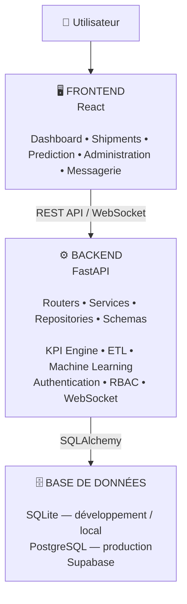

# 🚢 Plateforme intelligente de pilotage et de prédiction des performances logistiques

## 📌 Présentation

Ce projet consiste en la conception et le développement d'une plateforme web intelligente dédiée au **monitoring des performances logistiques maritimes**.

La plateforme centralise les données relatives aux expéditions, automatise le calcul des indicateurs clés de performance (KPIs), permet l'analyse détaillée des opérations et intègre un modèle de Machine Learning destiné à **prédire le risque de retard des expéditions**.

Elle intègre également :

- la gestion des expéditions maritimes ;
- un dashboard interactif de suivi des KPIs ;
- l'analyse des performances par période et par carrier ;
- un module de prédiction du risque de retard ;
- une authentification sécurisée avec JWT ;
- une gestion des rôles et des permissions (RBAC) ;
- une messagerie interne en temps réel basée sur WebSocket ;
- une architecture conteneurisée et déployable en production.

L'objectif est de transformer les données opérationnelles en informations exploitables pour faciliter le **pilotage, l'analyse et l'anticipation des risques logistiques**.

---

## 🎯 Objectifs

La plateforme répond aux principaux objectifs suivants :

- Centraliser les données logistiques ;
- Améliorer la qualité et la cohérence des données ;
- Mettre en place un pipeline ETL pour préparer les données ;
- Automatiser le calcul des KPIs logistiques ;
- Permettre l'analyse des performances par période et par carrier ;
- Visualiser les indicateurs à travers un dashboard interactif ;
- Gérer les expéditions maritimes via une interface CRUD ;
- Identifier les expéditions présentant un risque de retard ;
- Intégrer un modèle de Machine Learning dans le processus métier ;
- Sécuriser l'accès à la plateforme ;
- Gérer les utilisateurs selon leurs rôles ;
- Permettre une communication interne en temps réel ;
- Conteneuriser et déployer la solution dans un environnement de production.

---
## 🏗️ Architecture

### 📂 Données

Les données logistiques utilisées pour le traitement ETL ne sont pas incluses dans le repository pour des raisons de confidentialité.

